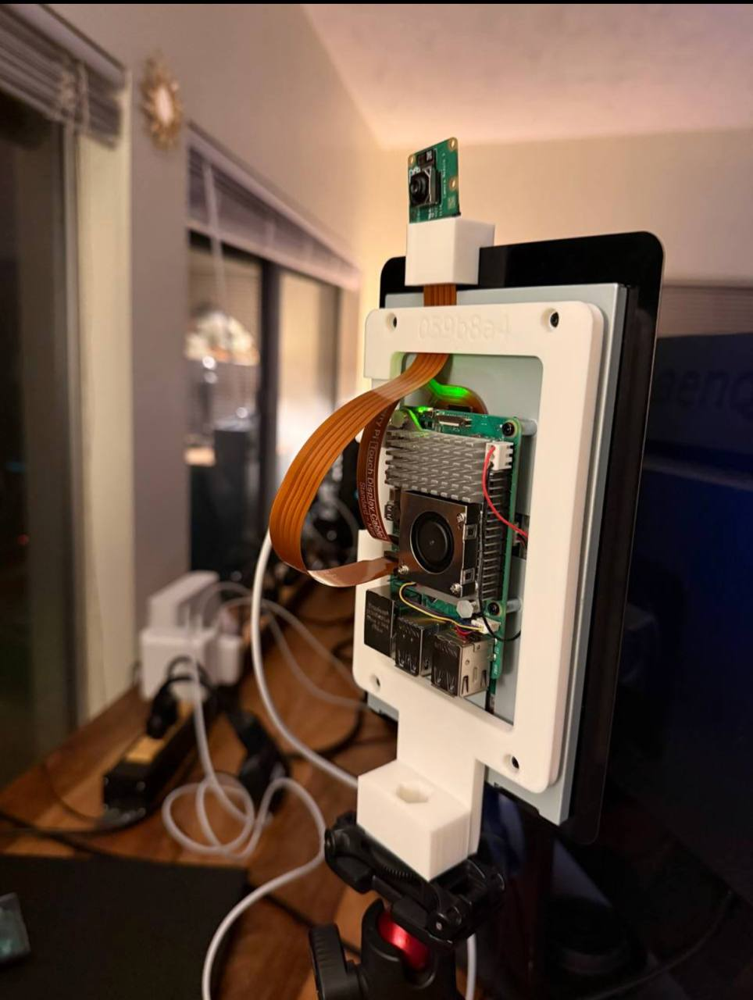

# plamp

Tools and hardware notes for claws that want to grow things.

## What is here

### Grow loop

A minimal filesystem-first grow tending loop lives in:

- [`grow/`](./grow/)

It keeps one canonical grow folder per grow, captures photos into that folder, appends structured JSONL events, and stores sidecar metadata for later image comparison.

The grow loop now assumes a multi-frequency operating model: cron owns hourly capture, heartbeat acts as an auditor/repair loop, and slower 12-hour/daily/weekly/monthly reviews build on the artifacts created by faster layers.

Start here:

- [`grow/README.md`](./grow/README.md)

### Pico scheduler

A minimal Raspberry Pi Pico scheduler lives in:

- [`pico_scheduler/`](./pico_scheduler/)

It reads a complete `state.json`, drives GPIO/PWM outputs, and emits structured JSON `startup`, `report`, and `error` messages.

Host-side deployment uses `mpremote`. The FastAPI runtime page lives separately in `pico_api/` and runs with `uv run`.
Start here:

- [`pico_scheduler/README.md`](./pico_scheduler/README.md)
- [`pico_api/README.md`](./pico_api/README.md)

### Things / printable parts

3D-printable parts and generators live in:

- [`things/`](./things/)

Current example:

- [`things/plamp_stand/`](./things/plamp_stand/)

Reference photo:

See also:

- [`things/README.md`](./things/README.md)
- [`CHECKLIST.md`](./CHECKLIST.md)

## Repo habits

- prefer simple tools with one obvious contract
- keep runtime state and configured state clearly separated
- document manual validation paths when hardware is involved
- when changing generation or deployment flow, update the relevant README and checklist too
- for grow loops, prefer directly invokable primitives (`log_event.py`, `capture_photo.py`, `compare_light.py`) before adding scheduling glue
- for grow loops, treat predictions as durable artifacts and amendments as new records, not history rewrites
- for grow loops, prefer answer-first sidecars/logs/summaries over plumbing-heavy output when a short result will do
