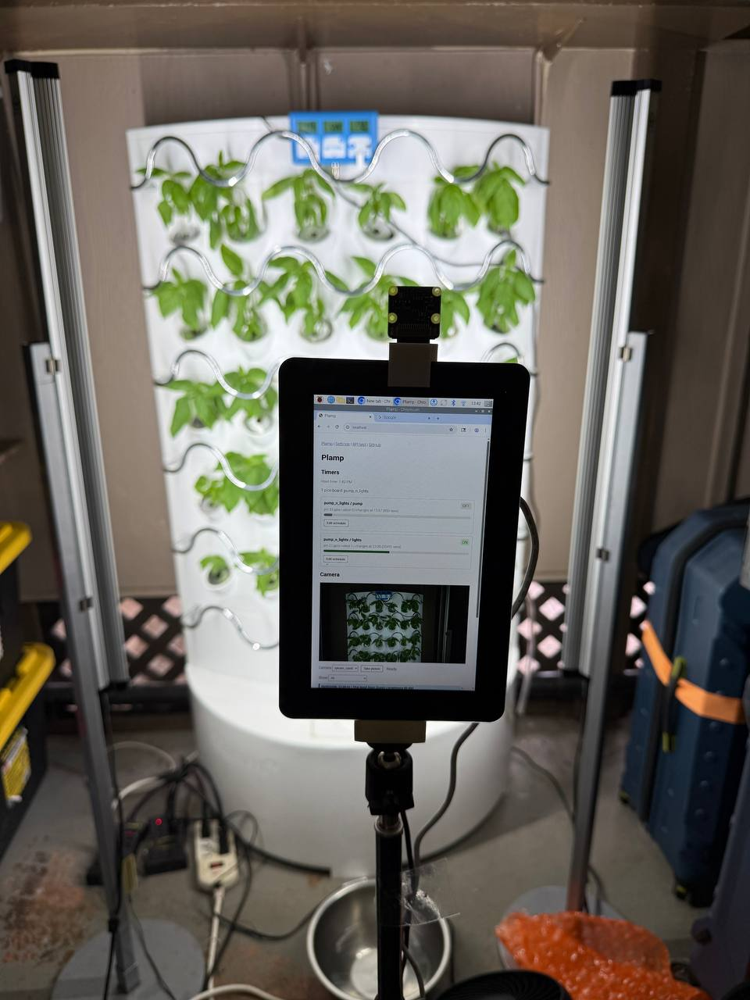

# Plamp

Local-first hydroponics automation for Raspberry Pi and MicroPython Picos. Picos run lights and pumps independently; the Pi adds configuration, monitoring, pictures, agents, and a fallback web UI.



## Install

On a Raspberry Pi:

```bash
curl -fsSL https://raw.githubusercontent.com/hugomatic/plamp/main/deploy/bootstrap/install-plamp.sh | bash
```

This installs Plamp and starts `plamp-web` on `127.0.0.1:8000`. Useful options:

```bash
# Public port 80 through nginx
curl -fsSL https://raw.githubusercontent.com/hugomatic/plamp/main/deploy/bootstrap/install-plamp.sh | bash -s -- --public

# Update OS packages during installation
curl -fsSL https://raw.githubusercontent.com/hugomatic/plamp/main/deploy/bootstrap/install-plamp.sh | bash -s -- --update-os

# Install somewhere else
curl -fsSL https://raw.githubusercontent.com/hugomatic/plamp/main/deploy/bootstrap/install-plamp.sh | bash -s -- --plamp-dir ~/code/plamp
```

The installer labels required runtime dependencies separately from the tools
included for humans and agents. See [Host tools](./docs/host-tools.md).

Host lifecycle commands use `plampctl`:

```bash
systemctl is-active plamp-web
./plampctl restart
./plampctl upgrade
```

## Operate Plamp

The installed JSON-first CLI currently talks to the local REST API:

```bash
plamp config get
plamp controllers list
plamp pico-scheduler list
plamp pics list
```

The direct library CLI shares short hardware locks with `plamp-web`:

```bash
source ./setup.sh
uv run python -m plamp context
uv run python -m plamp config get
uv run python -m plamp pico report pump_lights
uv run python -m plamp pico pulse pump_lights 21 5
uv run python -m plamp pico configure pump_lights compiled-state.json
uv run python -m plamp pico upgrade pump_lights compiled-state.json
uv run python -m plamp camera capture rpicam_cam0
```

Use `-` instead of `compiled-state.json` to read the complete compiled scheduler state from stdin. Configure sends that state through the shared locked Pico protocol. Upgrade renders the current generic scheduler firmware, seeds both state slots, resets once, and verifies the reconnected report. These commands work while the service is running or stopped and do not contact `plamp-web`. Remote agents can use either the REST CLI or direct CLI over SSH.

`setup.sh [DATA_DIR]` selects the checkout and instance for the current shell. It exports `PLAMP_ROOT` and `PLAMP_DATA_DIR`; without an argument, data defaults to `$PLAMP_ROOT/data`. Source another checkout's setup script to switch versions without leaving its executable paths behind.

See [CLI reference](./plamp_cli/README.md).

## Web and API

Open `http://<raspberry-pi-ip>/` after a public install, or port `8000` otherwise.

- `/`: live controller state, schedule editing, and pictures
- `/settings`: hardware and configuration
- `/api/test`: executable API examples
- `/api/config`: desired configuration
- `/api/system`: host and detected hardware
- `/api/status`: resolved state and telemetry

The browser receives live updates through SSE. See [web service notes](./plamp_web/README.md).

## Configuration

Runtime configuration lives in `$PLAMP_DATA_DIR/config.json`; generated scheduler state lives beside it in `$PLAMP_DATA_DIR/timers/`. Both are local runtime data. The web system page shows the effective root and data paths.

Controllers contain desired device behavior, display settings, and a stable Pico USB serial. `/dev/ttyACM*` paths are rediscovered. See the [current contract](./docs/spec-current.md) for the normalized shape.

## Development

```bash
uv run python -m unittest discover -s tests -v
uv run uvicorn plamp_web.server:app --host 127.0.0.1 --port 8000 --reload
```

Stop the boot service before running a development server, then restore it afterward.

## Repository

- [`docs/spec-current.md`](./docs/spec-current.md): current contract and direction
- [`plamp/`](./plamp/): direct library and CLI
- [`plamp_cli/`](./plamp_cli/): REST-backed CLI
- [`plamp_web/`](./plamp_web/): REST, SSE, scheduled reports/pictures, and fallback UI
- [`pico_scheduler/`](./pico_scheduler/): generated MicroPython scheduler firmware
- [`things/`](./things/): printable parts
