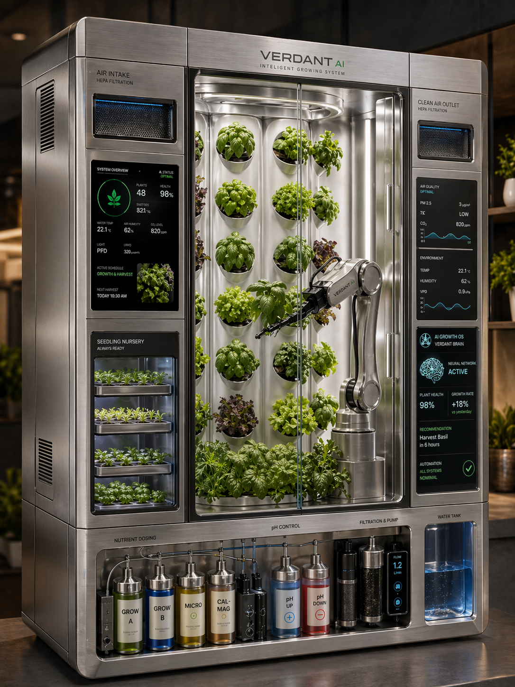
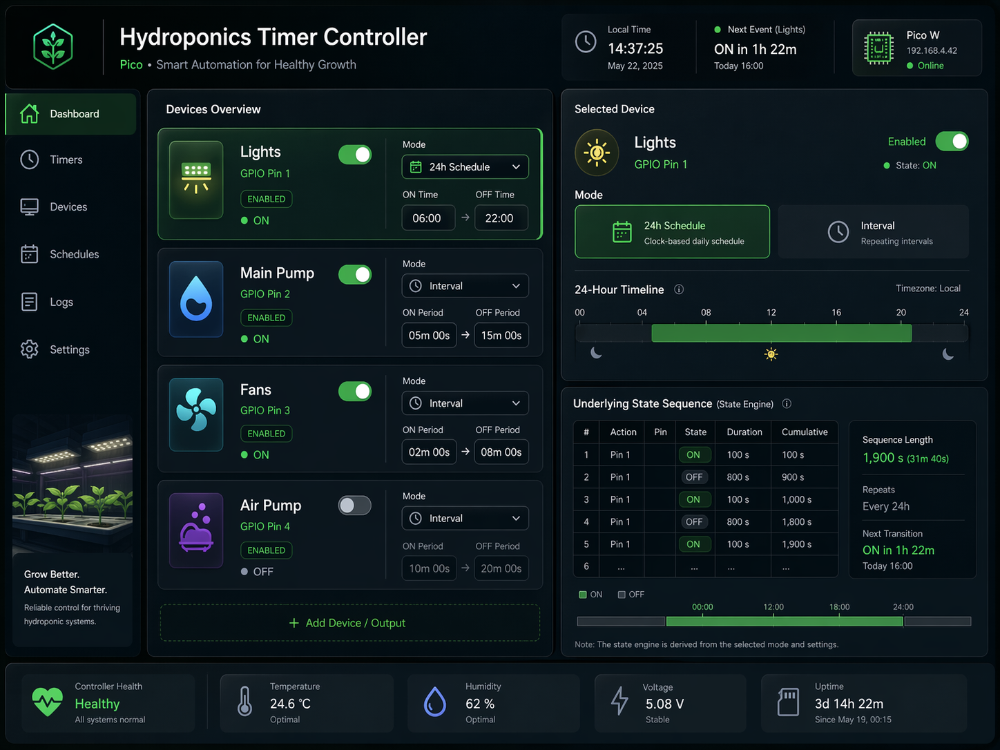

# Plamp Current Spec

Last updated: 2026-05-05

This is the canonical product and engineering spec for Plamp.
It exists to preserve direction, prevent regressions, and keep growth coherent.

## 1) Vision: Reliable Agriculture For Everybody

### Current System

Plamp is local-first hydroponics automation that is understandable and modifiable by humans and agents.

### Evolution

1. Seed phase: reliable pump/light scheduling and direct Pico control.
2. Integration phase: one operational admin surface with stronger visibility.
3. Platform phase: controller contracts + firmware families for future growth.

References:

- [Settings Unification](./superpowers/specs/2026-04-15-settings-unification-design.md)
- [Firmware Family API and CLI](./superpowers/specs/2026-05-04-firmware-family-api-and-cli-design.md)

### Pattern Guard

- Do not introduce opaque black-box automation.
- Do not make cloud connectivity required for core operation.
- Do not split the conceptual model between GUI and CLI.

Image placeholder:

- Title: `Reliable Agriculture For Everybody`
- URL: `./images/agri-factory.png`
- Embed:


## 2) System Shape and Stack

### Current System

Core components:

- `plamp_web` (FastAPI + server-rendered pages)
- `plamp_cli` (argparse, JSON-first commands)
- firmware families (`pico_scheduler`, `pico_doser` placeholder)
- runtime state in `data/`

Toolchain:

- `uv`, `FastAPI`, `uvicorn`, `pyserial`, `mpremote`, `MicroPython`

### Evolution

1. Chose a local-first Raspberry Pi deployment so growers can run and recover the system without cloud dependency.
2. Kept hardware control explicit (`pyserial`, `mpremote`) so failures are diagnosable at the bench, not hidden behind abstractions.
3. Added JSON-driven firmware generation so controller behavior is reproducible, reviewable, and safe to evolve over time.

References:

- [Pico Scheduler Firmware Generator](./superpowers/specs/2026-05-04-pico-scheduler-firmware-generator-design.md)

### Pattern Guard

- Prefer explicit local tools over hidden wrappers.
- Keep orchestration inspectable from terminal and source.

## 3) GUI Contract

### Current System

`/` must:

- show current runtime controller/device state
- support schedule edits for configured scheduler devices
- expose capture context

`/settings` must:

- be the single admin/config surface
- keep `System status / Peripherals` read-only
- keep assignment editing in `Pico schedulers`
- preserve grouped-by-controller scheduler editing
- save in combined top-level config shape

`/api/test` must:

- provide live examples for current API payload contracts

### Evolution

1. Early split admin views caused friction.
2. Unified settings established one place for setup + status.
3. Scheduler UX evolved toward grouped controller blocks with assignment clarity.

References:

- [Settings Unification](./superpowers/specs/2026-04-15-settings-unification-design.md)
- [Pico Schedulers Settings Redesign](./superpowers/specs/2026-04-30-pico-schedulers-settings-design.md)

### Pattern Guard

- Do not reintroduce editable controls into status-only tables.
- Do not split scheduler editing back into disconnected sections.
- Do not hide peripheral assignment state.

Image placeholder:

- Title: `Learnable And Modifiable System`
- URL: `./images/agri-ui.png`
- Embed:


## 4) Canonical Data Model

### Current System

Host config:

```json
{
  "controllers": {
    "pump_lights": {
      "type": "pico_scheduler",
      "pico_serial": "e66038b71387a039",
      "report_every": 10
    }
  },
  "devices": {
    "pump": {
      "controller": "pump_lights",
      "pin": 3,
      "editor": "cycle"
    }
  },
  "cameras": {}
}
```

Invariants:

- controller IDs are global + unique
- reserved IDs are blocked
- devices are top-level and reference controller IDs
- pin collisions are invalid per controller

### Evolution

1. Simplified to stable top-level config groups.
2. Kept `devices` top-level for global validation and rename safety.
3. Treated GUI grouping as presentation, not storage.

References:

- [Config Model Simplification](./superpowers/specs/2026-04-14-config-model-simplification-design.md)
- [Pico Scheduler Devices Payload](./superpowers/specs/2026-05-03-pico-scheduler-devices-payload-design.md)

### Pattern Guard

- Do not silently migrate to nested-per-controller device storage.
- Do not duplicate identity layers for controllers/devices.

## 5) API and CLI Contract

### Current System

Controller API:

- `GET /api/controllers`
- `GET /api/controllers/{controller}`
- `PUT /api/controllers/{controller}`
- `POST /api/controllers/{controller}/channels/{channel_id}/schedule`

CLI top-level sections:

- `config`, `controllers`, `pico-scheduler`, `pics`, `firmware`

CLI behavior:

- no-arg prints help
- missing sections/actions return actionable hints

### Evolution

1. Moved from timer-centric naming toward controller-centric contracts.
2. Standardized CLI shape around explicit command sections.
3. Improved parser errors to guide real usage.

References:

- [Firmware Family API and CLI](./superpowers/specs/2026-05-04-firmware-family-api-and-cli-design.md)
- [Plamp CLI Design](./superpowers/specs/2026-04-30-plamp-cli-design.md)

### Pattern Guard

- Do not create parallel route families for the same concept.
- Do not hide required payload fields behind implicit defaults.
- Do not regress to parser-internal error wording only.

## 6) Firmware Families and Growth

### Current System

Families:

- `pico_scheduler` active
- `pico_doser` placeholder

Workflow:

1. payload JSON
2. generate firmware source
3. optional show/pull
4. flash by port
5. verify report behavior

### Evolution

1. Initial model: firmware read config on-device, so config had to be copied to Pico storage.
2. Transitional model: host flashed/reset Pico and copied both `main.py` and config payload files.
3. GUI era: web server became the operational control point and managed firmware/state writes.
4. Current model: host generates dedicated firmware from JSON and flashes it, with behavior embedded in generated `main.py`.
5. Expected future: generation and programming flow may evolve again as new firmware families mature.

References:

- [Pico Scheduler Firmware Generator](./superpowers/specs/2026-05-04-pico-scheduler-firmware-generator-design.md)
- [Firmware Family API and CLI](./superpowers/specs/2026-05-04-firmware-family-api-and-cli-design.md)

### Pattern Guard

- Do not lock future families into scheduler-only assumptions.
- Do not generate firmware that is hard to inspect/diff.
- Do not bypass service ownership of serial link in normal operation.

### Serial Link Ownership

In normal operation, `plamp_web` keeps the serial relationship with Pico active for runtime monitoring/control.
That means CLI operations that need device state/programming should go through the web API path unless explicitly doing local power-user maintenance.

Guard:

- avoid designing CLI flows that compete with live web-held serial sessions by default
- if direct serial access is required, it must be an explicit operational mode, not implicit behavior

## Maintenance Rules

When behavior changes:

1. update this file first
2. update tests
3. update user docs if contract changed
4. ship in one PR
